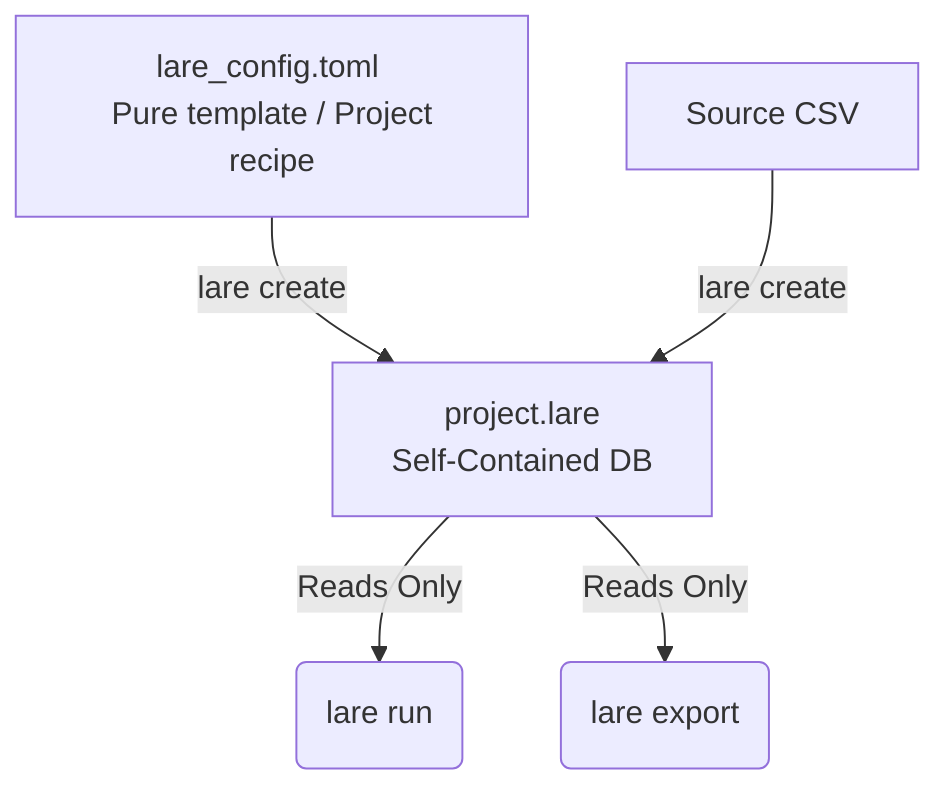

<h1 align="center">
    
</h1>

[](https://pypi.org/project/lare/)

A high-velocity, self-contained inference auditing and dataset labeling tool. LARE provides a highly optimized pipeline for reviewing and classifying multimodal data (e.g., FITS images and attention maps) using a structured, keyboard-driven web interface and a robust SQLite-backed queuing system.

## Table of Contents
- [Installation](#installation)
- [CLI Commands](#cli-commands)
- [Architecture & Lifecycle](#architecture--lifecycle)
- [Configuration Model](#configuration-model)
- [Database Schema](#database-schema)
- [Web UI & Ergonomics](#web-ui--ergonomics)

## Installation

Install the base package via pip:

```bash
pip install lare
```

To enable support for scientific FITS image processing (`astropy`, `matplotlib`, `numpy`), install with the `fits` extra:

```bash
pip install "lare[fits]"
```

## CLI Commands

### `lare create`
The initialization and pipeline seeding engine.

- **Interactive Guide:** Walks users through creating a `lare_config.toml` if one is not provided.
- **Template Fallback:** Prompts to use an existing `lare_config.toml` if found in the current directory.
- **Safety Lock:** Prevents accidental overwriting of an existing `project.lare` database file.
- `--config PATH`: Bypasses interactive prompts to use a specified external configuration file.
- `--no-project`: Authors the configuration file interactively without compiling the data or creating the database.
- **Collision Check Constraint:** Enforces namespace uniqueness when using the `stem` extraction method, raising a validation error on duplicate file names.
- **Freezing State:** Serializes evaluated configuration parameters into `project_metadata.config_json` inside the database.

### `lare run [PROJECT]`
Starts the runtime engine using the `.lare` database file as the absolute source of truth.

- **Isolation:** Ignores any local or external `.toml` files on disk, reading all shortcuts, paths, and rendering properties directly from the internal `config_json`.
- **Execution:** Launches a local FastAPI server, mounts static image assets, serves the compiled React production client, and automatically opens the user's default web browser.

### `lare export [PROJECT]`
Extracts classifications based on internal schema instructions.

- **Strategies:**
  - `csv`: Dumps a flat table containing audited rows to a target path.
  - `copy`: Aggregates the raw image files that received classifications and copies them to an organized target subdirectory pattern.
- **Flags:** Requires `--strategy csv|copy` and `--output PATH`.
- **Audit Metric Guard:** Validates the number of audited rows against the total queue and flashes a warning if the audit is incomplete.

## Architecture & Lifecycle

LARE operates on a reproducible, self-contained architecture. The entire workflow is governed by a declarative template configuration (`lare_config.toml`) which compiles source data into an immutable, frozen SQLite database state (`project.lare`).



## Configuration Model

Projects are defined via a declarative `lare_config.toml` recipe.

```toml
[paths]
# The SQLite database containing labeling progress
project = "project.lare"
# When set, paths in the CSV are overridden to be image_directory + basename
image_directory = "images/"

[rules]
# SQL expressions for use with Polars
filter_method = "GREATEST(sim_class_0, sim_class_1, sim_class_2) > 0.1"
ranking_score = "GREATEST(sim_class_0, sim_class_1, sim_class_2)"

# Which column in the CSV to use as the entry ID
id_column = "filepath"
# Can also be "raw" or "basename"
id_display_method = "stem"

[[images]]
column = "filepath"
title = "Galaxy"
format = "fits"
stretching = "asinh"
min_threshold = 0.5
max_threshold = 99.5
subdirectory = "galaxies"

[[images]]
column = "attention_png"
title = "Attention map (CBAM)"
format = "png"
subdirectory = "attention_maps"

[[labels]]
label = "sim_class_0"
title = "PSG"
shortcut = "s"

[[labels]]
label = "sim_class_1"
title = "PTS"
shortcut = "t"
```

## Database Schema

Table structures are built dynamically at runtime by cross-referencing Polars DataFrame schemas with target SQLite columns. 

```sql
-- Table 1: Complete project footprint and frozen configurations
CREATE TABLE project_metadata (
    project_id TEXT PRIMARY KEY,       -- Random UUIDv4 generated during `lare create`
    created_at TEXT DEFAULT CURRENT_TIMESTAMP,
    config_json TEXT NOT NULL          -- Entire evaluated TOML structure frozen as JSON
);

-- Table 2: High-throughput labeling queue
CREATE TABLE labeling_queue (
    queue_order INTEGER PRIMARY KEY,  -- Strictly enforces the frozen Polars ranking
    entry_id TEXT UNIQUE NOT NULL,    -- Absolute identifier (e.g. true raw csv filepath/hash)
    display_id TEXT NOT NULL,         -- Extracted target identifier mapped to config rules
    final_label TEXT DEFAULT NULL,    -- The ONLY mutable state column in the app
    
    -- Real columns dynamically injected from the CSV fields at creation
    filepath TEXT,
    attention_png TEXT,
    sim_class_0 REAL,
    sim_class_1 REAL,
    sim_class_2 REAL
);

-- Optimization Performance Indexes
CREATE INDEX idx_display_id ON labeling_queue(display_id);
CREATE INDEX idx_final_label ON labeling_queue(final_label);
```

## Web UI & Ergonomics

The user interface balances structural minimization with optimal keyboard tracking for high-velocity inference auditing.

### Left Panel: Universal Aspect-Ratio Grid
- Renders assets side-by-side using a clean CSS grid wrapper.
- Enforces standard row heights matching the viewport while allowing flexible widths to preserve physical aspect ratios across multimodal formats (e.g., wide FITS plots next to square attention maps).

### Right Panel: Information & Controls Hub
- **Title Anchor:** Displays the current entry's clean `display_id`.
- **Inference Action Targets:** Block buttons mapped to explicit classification shortcuts (e.g., `PSG (s)`). Displays structural supporting labels indicating prediction weight (`SCORE: {score}`).
- **Mutations & Queue Advancement:** Clicking an action target or invoking a shortcut writes the choice to `final_label` in SQLite, appends the ID to a session stack, and immediately transitions the view state to the next row where `final_label IS NULL`.

### Navigation Safety Features
- **Active Field Input Trap:** Bypasses single-letter global shortcuts when `document.activeElement` matches a text input (e.g., the "Jump To" field) to avoid accidental triggers.
- **"Previous Entry" Stack:** Allows users to step backward, overwriting previously registered tags or fixing rapid misclicks cleanly.
- **"Jump To" Processing Logic:** Resolves queries against indexed database fields. On namespace collisions, a structured conflict layout provides a clean micro-dropdown to select the desired target.

### Image Serving Pipeline
- **Decoupled Asset Threading:** The FastAPI backend manages standard static local asset streaming.
- **Pre-rendering:** Avoids computing complex transformations (asinh arrays, thresholds) iteratively on-the-fly. The server pre-processes image arrays, dumping lightweight web-friendly representations into a hidden footprint directory, which is purged when LARE closes (capped at a 25-image lookahead).
